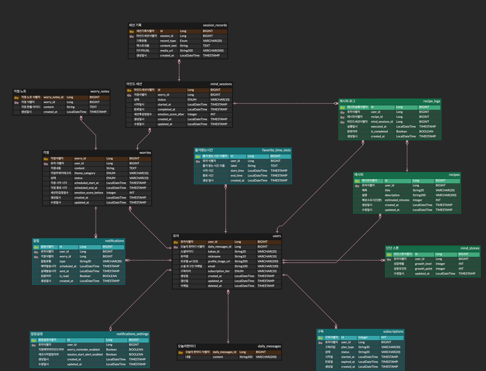
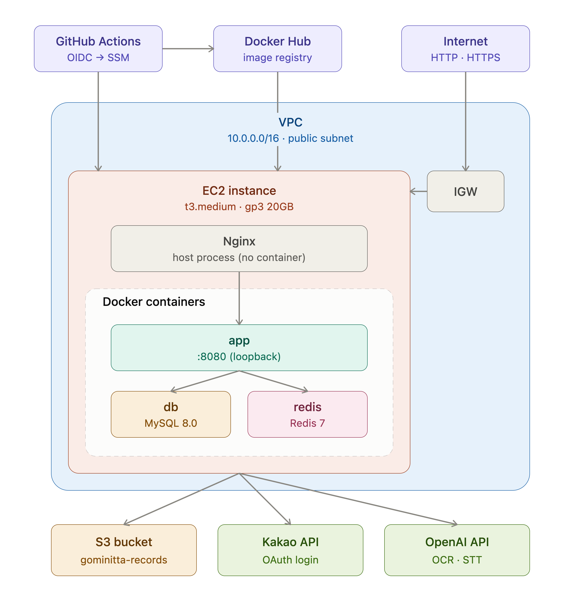

<div align="center">

# 고민이따 Back-end Repository

"걱정과 마주하고, 감정을 기록하며, 나를 이해하는 **마음 챙김 서비스**"

**고민이따**의 백엔드 저장소입니다.

<br/>

</div>

---

## ✨ 핵심 기능

### 🔐 인증 및 회원 관리 (Auth/User)
- **Kakao 소셜 로그인/회원가입**
    - Kakao OAuth2 기반 간편 로그인 지원
- **JWT 기반 인증 구조**
    - Access Token / Refresh Token 이중 토큰 방식 적용
    - Refresh Token Redis 저장을 통한 자동 로그인 및 보안성 강화
- **데일리 메시지**
    - 매일 자동 발송되는 마음 챙김 동기부여 메시지

### 😟 걱정 예약 (Worry)
- **걱정 등록 및 조회**
    - 걱정 제목/내용 분리 저장 및 예약 시간대 설정
- **걱정 노트 (한 줄 보태기)**
    - 걱정에 대한 짧은 메모 추가 기능
- **즐겨찾는 시간**
    - 사용자가 자주 사용하는 시간대 등록 및 관리

### 🧘 마음 세션 (Session)
- **세션 생성 및 진행**
    - 걱정과 연결된 세션 생성 (SCHEDULED → IN_PROGRESS → COMPLETED)
    - 레시피 기반 마음 챙김 활동 연결
- **멀티모달 세션 기록**
    - 텍스트/음성/필기 기록 AWS S3 업로드
    - 서명된 URL(Signed URL)을 통한 보안 미디어 접근
    - 업로드 파일 검증 (크기/MIME/매직바이트) 및 Rate Limit 적용

### 🍀 레시피 (Recipe/Growth)
- **시스템 레시피 및 개인 레시피 관리**
    - 관리자 제공 기본 레시피 + 사용자 커스텀 레시피 생성
- **레시피 실행 로그**
    - 레시피 수행 기록 저장 및 성장 추적
- **랜덤 레시피 추천**
    - 이미 등록한 레시피를 제외한 랜덤 추천 제공

### 📊 리포트 및 알림 (Report/Notification)
- **마음 리포트 3종**
    - 걱정 타임라인 — 기간별 걱정 발생 추이 집계
    - 불안 온도차 — 세션 전후 감정 변화 비교
    - 걱정 테마 지도 — 걱정 키워드 기반 테마 분류 시각화
- **세션 알림 스케줄링**
    - 설정된 시간에 세션 시작 알림 자동 발송
    - 알림 읽음 처리 및 목록 조회

---

## ⚙ 기술 스택

| 파트 | 기술 |
|:---:|:---:|
| BackEnd | Java 17, Spring Boot 3.5, Spring Security, JPA, Flyway |
| DataBase | MySQL, Redis |
| Auth | Kakao OAuth2, JWT |
| Storage | AWS S3 |
| Infra | Docker, AWS EC2 |
| AI | OpenAI (STT, OCR) |
| etc. | Swagger, Notion, Discord |

---

## 💁‍♂️ 프로젝트 팀원

<div align="center">
<table>
<tr>
<td align="center" style="width: 150px; padding: 10px;">
<br/>
<b>catomat0 (김동국)</b><br/>
<sub>Auth/User · 카카오 로그인, JWT, 데일리 메시지</sub>
</td>
<td align="center" style="width: 150px; padding: 10px;">
<br/>
<b>dmlwjds2 (곽의정)</b><br/>
<sub>Worry · 걱정 예약/조회, 한 줄 보태기, 즐겨찾는 시간</sub>
</td>
<td align="center" style="width: 150px; padding: 10px;">
<br/>
<b>kiwi248 (윤기화)</b><br/>
<sub>Session · 세션 시작/완료, 멀티모달 기록</sub>
</td>
<td align="center" style="width: 150px; padding: 10px;">
<br/>
<b>chaerishme (송채원)</b><br/>
<sub>Recipe/Growth · 레시피 목록/실행</sub>
</td>
<td align="center" style="width: 150px; padding: 10px;">
<br/>
<b>anhyunjung (안현정)</b><br/>
<sub>Report/Notification · 리포트 3종, 알림 스케줄링</sub>
</td>
</tr>
</table>
</div>

---

## 🧺 ETC.

### ERD 구조
<div align="center">

</div>

### 아키텍처
<div align="center">

</div>

### 패키지 구조
도메인형 패키지 구조를 기반으로 비즈니스 로직(`domain`)과 공통 인프라(`global`)를 분리한 구조입니다.

```
com.gominitta.backend
├── domain
│   ├── auth             # 인증 (Kakao OAuth, JWT)
│   ├── user             # 회원 관리
│   ├── worry            # 걱정 예약
│   ├── session          # 마음 세션
│   ├── record           # 세션 기록 (텍스트/음성/필기)
│   ├── recipe           # 레시피
│   ├── notification     # 알림
│   ├── report           # 리포트
│   ├── dailymessage     # 데일리 메시지
│   └── favortietimeslot # 즐겨찾는 시간
└── global
    ├── auth             # JWT 필터, 유틸
    ├── oauth            # Kakao OAuth 클라이언트
    ├── config           # Security, Redis, Swagger 설정
    ├── common           # 공통 응답, 예외 처리
    ├── storage          # S3 / 로컬 파일 저장소
    ├── ratelimit        # Rate Limiting
    └── scheduler        # 스케줄러 (유저 정리, 데일리 메시지)
```
